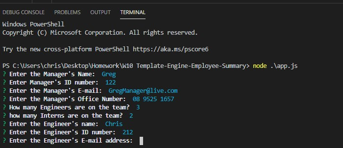
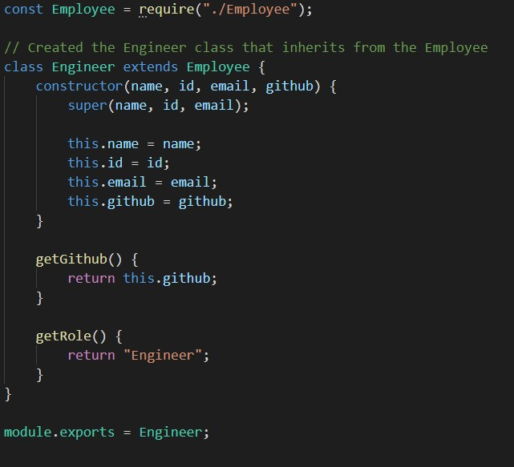
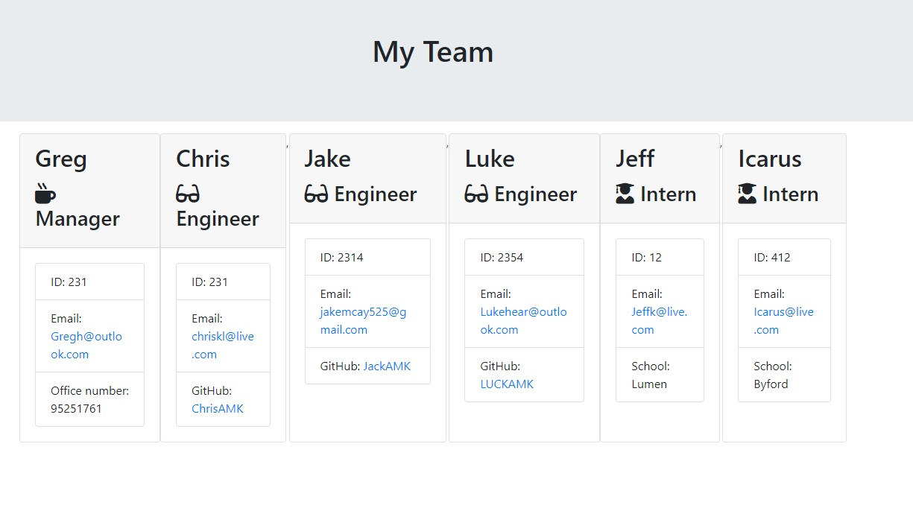

# Unit 10 OOP Homework: Template Engine - Employee Summary

This weeks Assignment was to Create a Command Line Application that generates a HTML file that displays basic information on a company's employee. The information is all given by the user with the help of the Inquirer Module, where we utilize the prompt function.  the user is prompted to Enter the Managers information and then is asked how many Engineers and Intern are to be entered. If that information given, the program knows how many times to ask the user for Individual Employees informaton. To kick off the Assignment we had to create the base "Employee" Class that contained a contructor with all the base infomation and functions that every other class will inherit from. Every other was set up to inherit from the Employee but then have their own specialised functions and information. Using Jest we can write code and test instantaniously to ensure no issue pop up later on. The hardest part of the program was going to be turning the objects into HTML but luckily the Render Module was provided.

